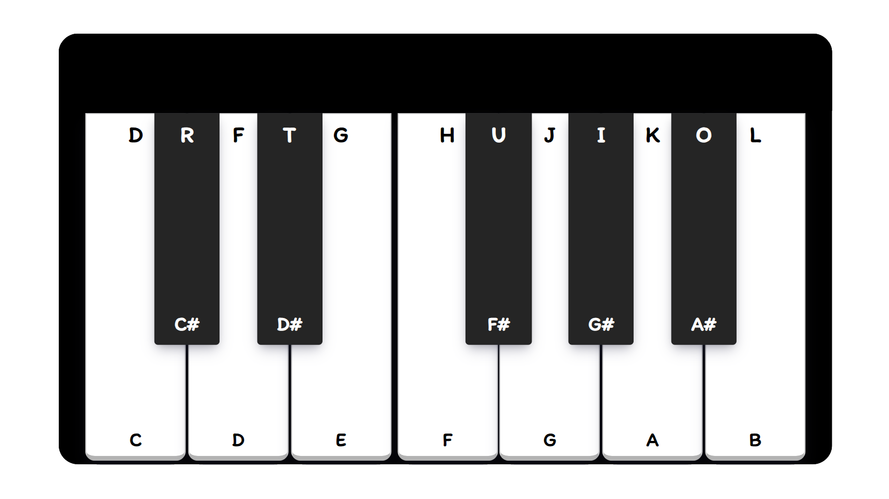

# Piano Project
[Demo](https://tbm85.github.io/Demo-Piano-Project/)

## Description
A piano made with Vanilla Js, CSS3 and HTML5.

## How to use?
* To produce any sound, click the keys with the mouse or press the keys on the keyboard.
* The letter you must press on your keyboard to get the desired key sound, is displayed at the top of each key.

## Resources
* [Piano Sounds](https://github.com/WebDevSimplified/JavaScript-Piano/tree/master/notes)
* [Itim Font](https://fonts.google.com/specimen/Itim)

## License
Copyright (c) 2021 Tania Ballester. This project is using [MIT License](LICENSE.md)